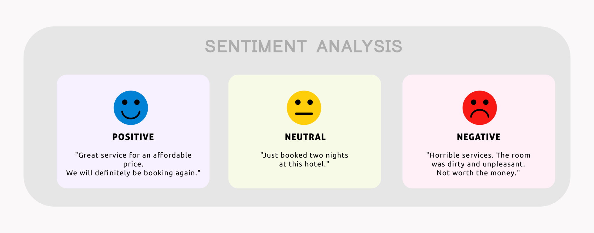

# Sentiment Analysis for Social Media Post
### A Final Project in Artificial intelligence Course 

&nbsp;&nbsp;&nbsp;&nbsp;&nbsp;&nbsp; Sentiment refers to the overall emotional tone or attitude conveyed in a piece of
text, speech, or communication, which expressed opinion, idea, or statement is
positive, negative, or neutral.
Reviews, likes, and comments on the internet are increasing their importance in
the evaluation of products and services by potential customers.
Our goal is to develop a sentiment analysis model that is both accurate and
efficient in classifying and understanding sentiments collected from a variety of
social media platforms.

**STEPS**
- **Data Collection:** collected data from Twitter
- **Data Preprocessing:** Clean the raw social media posts and prepare them for the
sentiment analysis model, ensuring that the text is in a format that can be easily
processed and analyzed.
- Read dataframe using pandas
- **Feature Extraction:** use WordNetLemmatizer for lemmatization and remove
the stopwords 
- **Model Architecture:** Using a **NLTK** and **Logistic Regression**
- **Model Training:** Split the preprocessed data into training, validation, and
test sets.
- **Evaluation:** Train the model on the training set, evaluated the final model
on the test set to measure its generalization performance. Applying
evaluation measures accuracy.

**FUTURE IMPROVEMENT**
- Enhancing the Model to Identify Violations Post 
- Audio or video-based sentiment analysis 
- Develop a comprehensive end-user application
```python
# Preprocess the text data
lemmatizer = WordNetLemmatizer()
stop_words = set(stopwords.words("english"))

# Split the dataset into training and testing sets
X_train, X_test, y_train, y_test = train_test_split(df_balanced['text_cleaned'], df_balanced['Sentiment'], test_size=0.2, random_state=42)
X_train

# Vectorize the text data using TF-IDF
tfidf_vectorizer = TfidfVectorizer(max_features=5000)
X_train_tfidf = tfidf_vectorizer.fit_transform(X_train)
X_test_tfidf = tfidf_vectorizer.transform(X_test)

# Train a logistic regression model
lr_model = LogisticRegression()
lr_model.fit(X_train_tfidf, y_train)
```
**Function preprocessing text**
```python
def preprocess_text(text):
    text = re.sub(r'http\S+', '', text)  # Remove URLs
    text = re.sub(r'<.*?>', '', text)  # Remove HTML tags
    text = re.sub(r'[^\w\s]', '', text)  # Remove punctuation
    text = text.lower()  # Convert to lowercase
    # Original: running, Lemmatized: running
    # Original: ate, Lemmatized: ate
    # Original: dogs, Lemmatized: dog
    # Original: better, Lemmatized: better
    # Original: rocks, Lemmatized: rock
    text = [lemmatizer.lemmatize(word) for word in text.split() if word not in stop_words]  # Lemmatization
    # For stop_words
    # Original text: This is an example sentence to demonstrate removing stopwords.
    # Filtered text: example sentence demonstrate removing stopwords.
    return ' '.join(text)
```
**Save Model**
```python
# Save the model and TF-IDF vectorizer to disk
joblib.dump(lr_model, 'sentiment_analysis_model.pkl')
joblib.dump(tfidf_vectorizer, 'tfidf_vectorizer.pkl')
```
### Core Api using Python FastApi
### Mobile App using Flutter